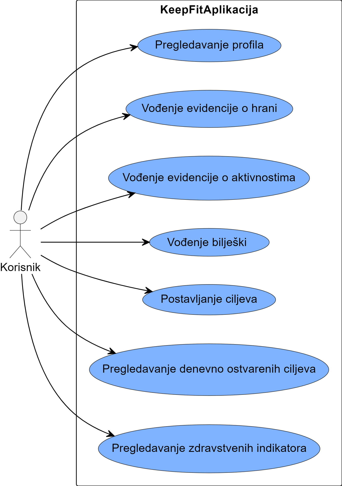
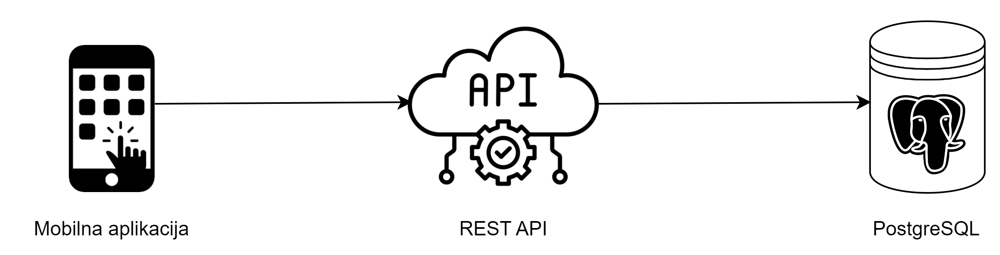
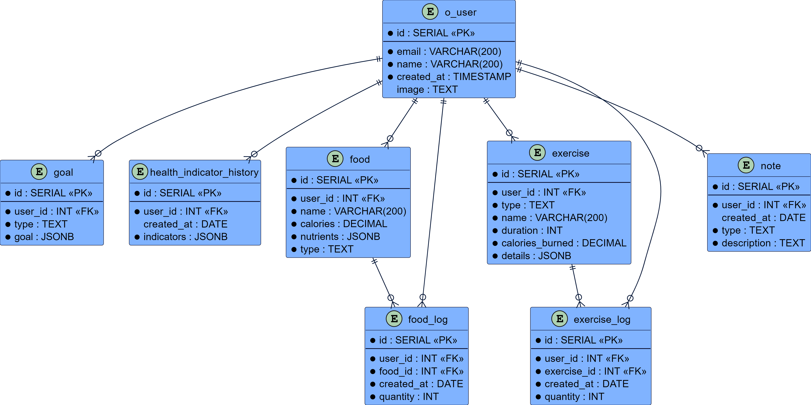

# Table of Contents
- [Project Specification](#project-specification)
    - [Features](#features)
    - [Project Architecture](#project-architecture)
    - [Entity-Relationship Diagram](#entity-relationship-diagram)
- [Setting up PostgreSQL Database](#setting-up-postgresql-database)
  - [Install PostgreSQL](#1-install-postgresql)
  - [Add PostgreSQL to Environment Variables](#2-add-postgresql-to-environment-variables)
  - [Initialize a Git Repository](#3-initialize-a-git-repository)
  - [Open one of the config files](#4-open-one-of-the-config-files)
  - [Changing Node.js server database usage](#changing-nodejs-server-database-usage)
  - [Running Node.js server](#running-nodejs-server)
  - [Running mobile application](#running-mobile-application)

## Project Specification

The `KeepFit` application represents a solution designed for users who aspire to a healthy lifestyle and wish to actively track their health goals. Developed with the aim of providing a simple way to monitor and manage health habits—nutrition and physical activity. The application encompasses the integration of temporal and active databases.


### Features


The use-case diagram represents all functionalities within the `KeepFit` mobile application.  

To explore the design of mobile application, please navigate to the [View folder](./docs/view/).

### Project Architecture



The diagram illustrates the architecture of the `KeepFit` mobile application at the highest level of abstraction. The first component is the user who will interact with the mobile application, which communicates with `NodeJs` Web service handling data within `PostgreSQL` database.

### Entity-Relationship Diagram



The diagram illustrates the Entity-Relationship diagram of `KeepFit` application. ER diagram consists of eight relations: `o_user`, `goal`, `health_indicator_history`, `food`, `exercise`, `note`, `food_log`, `exercise_log`.

## Setting up PostgreSQL Database

### 1. Install PostgreSQL:

If PostgreSQL isn't installed, install it (:

- **Download page:**
    ```bash
    https://www.postgresql.org/download/
    ```

### 2. Add PostgreSQL to Environment Variables:

Update `PATH` to access PostgreSQL commands globally:

- **Linux-mint:**
    ```bash
    echo 'export PATH=$PATH:/usr/lib/postgresql/<version>/bin' >> ~/.bashrc
    ```

- **Windows:**
    ```
    1. Edit the system environment variables
    2. Environment Varaibles
    3. Path
    4. Add path C:\Program Files\PostgreSQL\<version>\bin
    ```
    Replace `<version>` with the installed PostgreSQL version.

### 3. Initialize a Git Repository:

Clone Git repository from Github:

```bash
mkdir keeep-fit
cd keep-fit
git clone https://github.com/dskrlac274/tbp-keep-fit.git
```

### 4. Open one of the config files:
1. Depending on your OS
    1.  **Linux:**
        ```bash
        Open config-linux.sh
        ```
 
        - Ensure you have added following command:
            ```bash
            sudo nano /etc/postgresql/14/main/pg_hba.conf 
            ```
        - Add this to the begining of the file
            ```bash
            local   all            postgres,<your-user>                        md5

            ```


    2. **Windows:**
        ```
        Open config-ws.ps1
        ```
2. Change database properties
    ```
    DB_NAME="ime_baze"
    DB_USER="korisnicko_ime"
    DB_PASS="lozinka"
    ```
3. Run specific script
    1.  **Linux:**
        ```bash
        ./config-linux.sh
        ```

    2. **Windows:**
        ```
        .\config-ws.ps1
        ```
4. Database should be successfully configured

## Changing Node.js server database usage
1. Position to database folder and open Database.js file:
    ```bash
    cd .\keep-fit\software\api\database\
    ```
2. Change follwoing code to match your databse configuration:
    ```bash
    this.pool = new Pool({
        user: 'postgres',
        host: 'localhost',
        database: 'keep_fit',
        password: '<your-password>',
        port: 5432
    })
    ```

## Running Node.js server  

1. Position to api folder:

    ```bash
    cd .\keep-fit\software\api\
    ```
2. Run next command:  

    ```bash
    npm i
    ```
    Given command install's all application external dependancies and it's mandatory for the server to start.
3. Start Node.js server
    ```bash
    npm start
    ```

## Running mobile application  

Mobile application was written in Kotlin and UI was built using Android's recommended toolkit for building native UI's - **Jetpack Compose**. 

1. Firstly, you''ll need to install Android Studio
    ```bash
    https://developer.android.com/studio
    ```
2. Then, you''ll need to install Android's emulator, I recommend:  
    ```bash
    Pixel_3a_API_34
    ```
3. Run the application by pressing on run button
